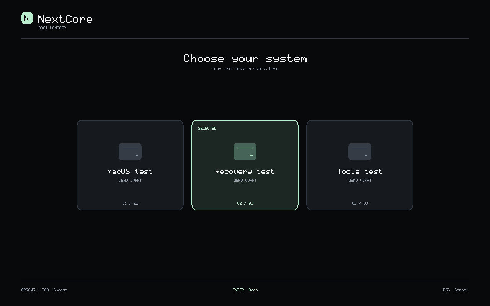

---
hide:
  - navigation
---

# NextCore

  <h1>NextCore — Intel &amp; Apple Silicon boot engineering</h1>
  

    A clean-room EFI bootloader with a graphical picker. Our targets are native
    HAL support for macOS 26 Tahoe and experimental AMD64 ↔ Apple Silicon HAL
    with Metal acceleration for macOS 27 Golden Gate.
  

  

  [Start here](wiki/README.md){ .md-button .md-button--primary }
  [Getting started](wiki/Getting-Started.md){ .md-button }
  [Supported models](wiki/Supported-Models.md){ .md-button }

  

!!! danger "Experimental alpha"

    Work from a full backup on a test machine. A passed static check, emulator
    probe, or firmware transfer is **never** presented as a physical-Mac or
    macOS boot result. Every acceptance boundary is documented per layer in
    [Boot engineering](wiki/Architecture.md).

## What this documentation covers

| Section | What you will find |
| --- | --- |
| [Quick start](wiki/README.md) | Install, configure, and run the guided tool |
| [macOS compatibility](wiki/macOS-Support.md) | Supported machines, Tahoe notes, known limits |
| [External EFI components](wiki/OpenCore.md) | Reference integration, EFI preparation, upstream attribution |
| [Application](wiki/Application.md) | GUI, Mellow mode, sandbox and validation harnesses |
| [Troubleshooting](wiki/Troubleshooting.md) | Common failures, GPU limitations, warnings |
| [Boot engineering](wiki/Architecture.md) | NextCore clean-room EFI/XNU handoff contracts and evidence |
| [Contribution](wiki/Developer.md) | PR workflow, branch and release policy, boundaries |

## Front page of the boot-engineering effort

| Layer | Current evidence |
| --- | --- |
| Firmware picker | Actual OVMF graphics, keyboard selection, cancellation and text fallback |
| Tahoe native EFI path | NextCore → original booter → XNU, readable Recovery GUI and Terminal |
| Golden Gate ARM64E preparation | Independent boot arguments and full host-memory KC staging/readback; guest entry unfinished |
| ARM firmware path | Restore transport reaches `bootx`; a device-contract failure remains |
| Host graphics | Actual Intel Vulkan compute, fence and result readback |
| Guest Metal | Tahoe Recovery probe executes and reports no Metal device; full OS/driver validation continues |

The pictured EFI test entries are authored validation fixtures. The picker
displays explicitly configured applications on its current volume; automatic
OS-volume discovery is not implemented yet. Metal acceleration remains a required
goal and is not claimed from a host-GPU or framebuffer test.

Detailed per-layer status lives in **NextCore validation** (repository)
[`nextcore/VALIDATION.md`](https://github.com/26x86/26x86/blob/main/nextcore/VALIDATION.md)
and the [current context][1]. The documentation site itself is built
from [`docs/`](https://github.com/26x86/26x86/tree/main/docs) with MkDocs
Material and deployed only from `main` through a pull request.

[1]: https://github.com/26x86/26x86/blob/main/docs/NEXTCORE_CURRENT_CONTEXT.md

## Working modes

- **x86 Mac mode** — prepares the EFI and root-patch path for native Intel Macs.
- **Apple Silicon Sandbox mode** — contained diagnostic and research path; never
  loads host kexts or applies root patches.
- **Surface Pro 6 / Tahoe orientation** — same evidence gate: *file checks are
  useful, but boot, display acceleration, audio, sleep, touch, and recovery each
  need runtime acceptance.*

See [Setup guides](SETUP.md) and [Supported hardware](wiki/Supported-Models.md).

## Project rules

- Public repositories contain clean-room source and public specifications only.
- `_isolated/` research material is excluded by Git and pre-commit guards and is
  never staged, committed, or pushed.
- An observation advances only the layer it measures; it cannot stand in for a
  later firmware, kernel, userspace, graphics, or physical-hardware result.
